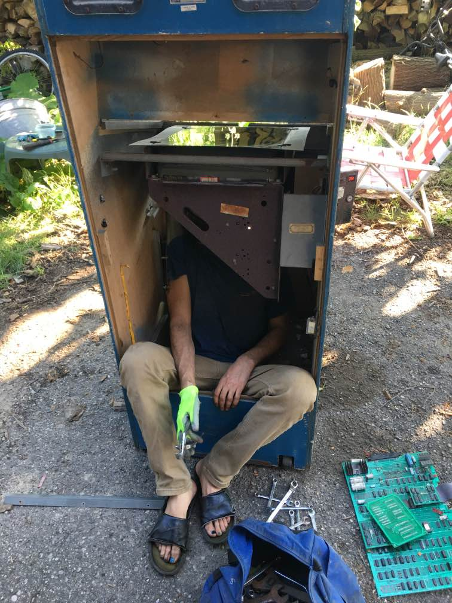
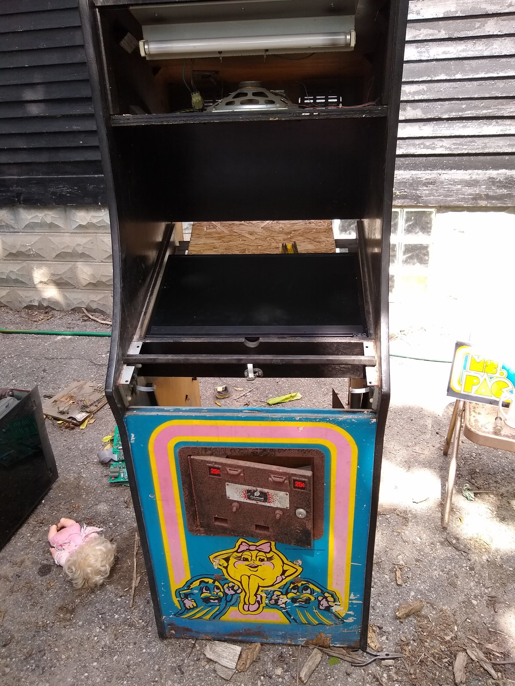
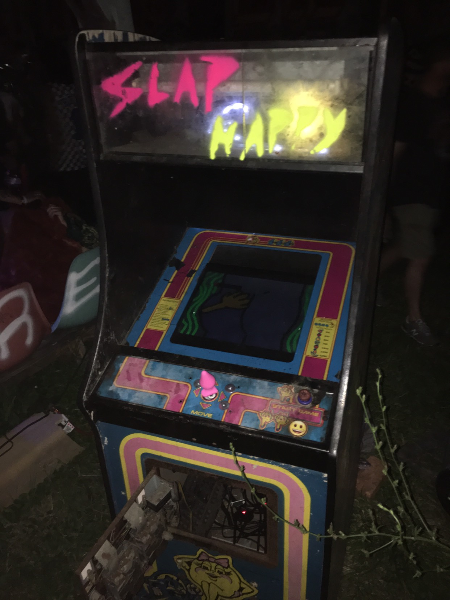

# slaphappy

This is a game I made for buttcon2019, detroit MI. The game is installed into a real arcade cabinet with a joystick and button

## Timeline

* July 8 - came up with idea to even do this arcade cabinet idea
* July 8 - got joysticks and buttons from microcenter
* July 10 - got arcade cabinet
* July 11 - made initial game sketch
* July 12 - did disassembly of machine
* July 13 - finished game, installed into the machine

## Disassembly

Disassembling the old machine was actually pretty elaborate and took a couple hours. I didn't want to be destructive so I undid all the bolts. I had to get inside the machine to get at the old screws as seen above. Then the arcade controls in front also had to be removed, which involved hacksawing off "carriage bolts" that were very rusted.

## Re-assembly

After the old TV was removed, I added a piece of plywood on top of the frame that held the old TV up, and then a flat screen fit perfectly on top of the plywood and was actually the perfect height so that the original glass could sit on top of the flatscreen.

Then reattaching new joystick required drilling new holes in the metal arcade front panel, but I only had an impact driver, so I had to the only drill bit that fit this which was really large so I also used massive washers when remounting it.

## Hardware

* Raspberry pi 2 running raspbian
* New Joystick and buttons
* XM10 chip which gets input from the new joystick/buttons
* A small HDMI tv

## Florishes

I used a glass cutter and a stencil to remake the top panel and stuffed it with some lights

I also added a buttplug to the joystick,  and a butt mold (a classic buttcon symbol) for the button

## Basic code optimizations I used

I developed the game on my computer, and once I moved it to the raspberry pi, there were some performance issues.

To improve performance I did some things like this

* used lower resolution images in the rendering
* used "sprite layers" so that all sprites are in a single sprite list
* the "sprite layers" aka LayeredSprite class also allows partial screen repainting rather than full screen repaint

## Conclusions

It was very easy to get started with pygame and was enjoyable to use.

Given more time, I would love to make the code more "software engineered" as it got very spaghettified towards the end trying to manage multiple game screens, but it was fun just slapping all the weird pieces together in a short amount of time

